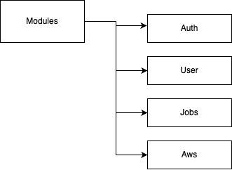
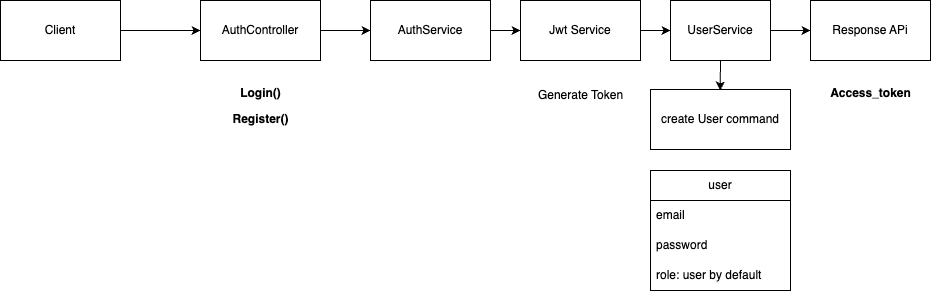

# HR platform

### **Links**

[Postman Link](https://www.postman.com/satellite-technologist-64110848/workspace/hr-platforn)

[LinkedIn Link](https://www.linkedin.com/in/samuelcharbit/)

[Github Link](https://github.com/samrub06/hrplatform)

[Notion Link]([https://www.notion.so/Notes-NodeJS-1519653b1ac1802a8da8d86fcedd3799?pvs=21](https://befitting-print-b6c.notion.site/Project-HR-platform-1509653b1ac1809f922dede0873e12e3?pvs=74))

### Description:

This HR management platform helps simplify recruitment and talent management. It’s built with NestJS for the backend, PostgreSQL for the database, and React for the user interface. 

Users can register, manage their profiles, upload documents, and track skills. Admins can control roles and review profiles securely. It also uses AWS S3 for file storage and ensures secure access with features like JWT authentication. Future updates will include faster performance and AI tools for better candidate matching.

**Use Case**

- User
    
    ### **UC-1: User Registration**
    
    - As a **Candidate,I want** to register using my email and password so that I can create an account and access the platform. I can register my personal information or with Google/Linkedin
        - **Flow**:
        1. Enter email and password.
        2. Create a user profile, with user_role: canditate.
        3. Redirect to the profile completion page.
    
    ### **UC-2: Profile Creation**
    
    - **As a Registered User, I want** to fill out my personal details so that my profile is complete and ready to be shared.
        - **Flow**:
        1. Enter personal information.
        2. Upload CV and profile picture.
        3. Add professional skills.
        4. Save profile information.
    
    ### **UC-3: Profile Update**
    
    - **As an Authenticated User, I want** to update my profile information so that my details remain accurate and up-to-date and can be sharable
        - **Flow**:
    1. Navigate to the profile edit page.
    2. Modify personal/professional information.
    3. Update skills and documents.
    4. Save changes.
    
    ### **UC-4: CV Upload**
    
    - **As a User, I want** to upload my CV securely so that it is stored safely and linked to my profile.
        - **Preconditions**: Logged in.
        - **Flow**:
            1. Select the CV file.
            2. Upload the file to secure S3 storage.
            3. Generate a pre-signed URL for the document.
            4. Update the profile with the document link.
    
    ### **UC-5: Skill Proficiency**
    
    - **As a User, I want** to specify my skill proficiency so that my expertise is accurately represented on my profile.
        - **Preconditions**: Profile exists.
        - **Flow**:
            1. Select a skill category.
            2. Define the proficiency level (1-5).
            3. Add professional context.
            4. Save the skill details.
    
    ### **UC-6: Skill Validation**
    
    - **As an Admin, I want** to validate user skills so that the platform maintains credibility.
        - **Flow**:
            1. Review user-submitted skills.
            2. Validate or adjust skill levels.
            3. Provide feedback to the user.
            4. Approve or reject the skills.
- Admin
    
    
    ### **UC-7: Admin Dashboard**
    
    - **As an Admin, I want** to add a user so that he can oversee his profile and give him credentials to authenticate and review his profile
        - **Flow**:
        1. Access the user management dashboard.
        2. Add a new User
    
    ### **UC-8: Admin Dashboard**
    
    - **As an Admin, I want** to view and manage users so that I can oversee platform activity efficiently.
        - **Flow**:
        1. Access the user management dashboard.
        2. View a paginated list of users.
        3. Filter and search users.
        4. Add confidential admin notes.
    
    ### **UC-9: User Role Management**
    
    - **As a Super Admin, I want** to assign or modify user roles so that permissions align with organisational needs.
        - **Flow**:
            1. Select a user from the dashboard.
            2. Modify the user’s role.
            3. Update role changes.
            4. Log the role modification for audit purposes.
    
    ### **UC-7: Admin Document Review**
    
    - **As an Admin, I want** to review candidate documents so that I can evaluate profiles effectively.
        - **Preconditions**: Access to candidate profiles.
        - **Flow**:
            1. Browse candidate documents.
            2. Download CVs.
            3. Add internal comments.
            4. Track document review history.
- External viewer
    
    ### **UC-10: Public CV Page**
    
    - **As an External Viewer, I want** to view a candidate's public profile so that I can evaluate their qualifications for potential opportunities.
        - **Flow**:
            1. Access the unique public profile URL link.
            2. View read-only professional information.
            3. See limited personal details (e.g., name and professional summary).

### **Architecture**

- Backend: NestJS
- Unit Testing + Testing End to End API :  Jest
- Database: PostgreSQL then on RDS AWS
- Migration: sur Squeelize with transaction
- Storage: AWS S3
- Versioning & Documentation API : Swagger UI + Link Postman
- Frontend: React + Ant Design
- Authentification: bcrypt + JWT tokens + auth0 ( Google )

### **Data Model**

**Jobs**:

- id
- name
- description
- salary_offered
- skills:  [language]:{name , years_required}
- global_year_experience
- work_condition
- city
- company_name
- contact_name
- phone_number
- email_address

**User**:

- id
- first_name ( varchar )
- last_name ( varchar )
- email ( varchar )
- password ( varchar )
- cv ( varchar )
- profilePicture ( varchar )
- Skills ( Object ex: {Javascript: {years: 2, level :3}, React: {years: 1, level :1})
- role (enum: USER, ADMIN, VIEWER )
- adminNotes (varchar)

## Architecture Modules

## Architecture UserModule

## Architecture Auth Flow

## **File Management**

- Secure S3 uploads in Frontend with Pre-signed URLs from the backend
- Download File with S3 Pre-signed Urls

## **Roadmap**

- **Phase 1**: Authentication & Profile Management
- **Phase 2**: RabbitMQ Integration
- **Phase 3**: Redis Caching
- **Phase 4**: Candidate Matching AI

---
